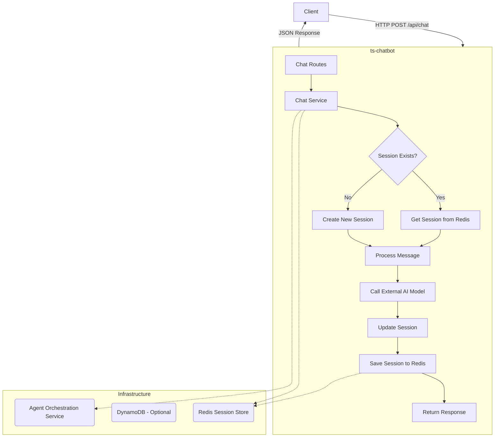

# Chatbot with Memory - TypeScript Edition

A simple, scalable chatbot backend built with Node.js, Express, and TypeScript, featuring session management with Redis. This project is a TypeScript replication of an original Python-based implementation.

## Features

- **RESTful API**: Built with Express for handling chat interactions.
- **Stateful Conversations**: Manages conversation history using Redis as a fast in-memory session store.
- **Scalable Architecture**: Clean separation of concerns between API, services, and data layers.
- **Asynchronous Processing**: Fully asynchronous implementation for non-blocking I/O.
- **Containerized**: Ready to deploy with Docker and Docker Compose.
- **Typed Codebase**: Fully written in TypeScript for better maintainability and developer experience.

## Architecture Overview

The application is designed with a classic three-tier architecture. A request from a client hits the API layer (Express), which then uses the service layer to handle the business logic. The service layer, in turn, communicates with the data layer (Redis) to persist and retrieve session data.

Here is a diagram illustrating the request flow:



## Project Structure

```
/ts-chatbot
├── dist/                     # Compiled JavaScript output
├── src/                      # TypeScript source code
│   ├── config/               # Environment configuration
│   ├── core/
│   │   ├── domain/           # Core domain models and interfaces
│   │   └── services/         # Business logic (e.g., ChatService)
│   └── infrastructure/
│       ├── routes/           # Express API routes
│       ├── redis_client.ts   # Redis client setup
│       └── dynamo_client.ts  # DynamoDB client setup
├── Dockerfile                # Instructions to build the app image
├── docker-compose.yml        # Defines services for Docker
├── package.json              # Project dependencies and scripts
└── tsconfig.json             # TypeScript compiler options
```

## Getting Started

### Prerequisites

- [Node.js](https://nodejs.org/) (v18 or later)
- [Docker](https://www.docker.com/) and [Docker Compose](https://docs.docker.com/compose/)

### Installation & Configuration

1.  **Clone the repository** (or navigate into the directory if you already have it).

2.  **Install dependencies**:
    ```bash
    npm install
    ```

3.  **Set up environment variables**:
    Create a `.env` file in the root of the `ts-chatbot` directory. This file is used for local development.

    ```env
    # Server Configuration
    PORT=3000

    # Redis Configuration
    REDIS_HOST=localhost
    REDIS_PORT=6379

    # AWS Configuration (optional)
    AWS_REGION=us-east-1
    # AWS_ACCESS_KEY_ID=...
    # AWS_SECRET_ACCESS_KEY=...
    ```

## Usage

### Running the Application

There are two ways to run the application:

**1. Local Development (with Nodemon)**

This method uses `ts-node` to run the app directly and `nodemon` to watch for file changes and automatically restart the server.

```bash
npm start
```

The server will be available at `http://localhost:3000`.

**2. Using Docker Compose**

This is the recommended method for a production-like environment. It builds the Docker image and starts the `app` and `redis` services.

```bash
docker-compose up --build
```

The server will be available at `http://localhost:3000` and will be connected to the Redis container.

### API Endpoints

#### `POST /api/chat`

Processes a user's message and returns the chatbot's response.

**Request Body**:

```json
{
  "sessionId": "some-unique-session-id",
  "message": "Hello, world!"
}
```

**Success Response (200 OK)**:

```json
{
  "role": "assistant",
  "content": "Echo: Hello, world!"
}
```

**Error Response (400 Bad Request)**:

```json
{
  "error": "sessionId and message are required"
}
```
